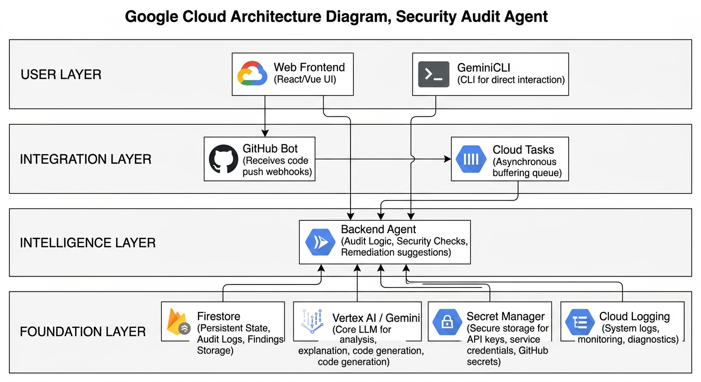
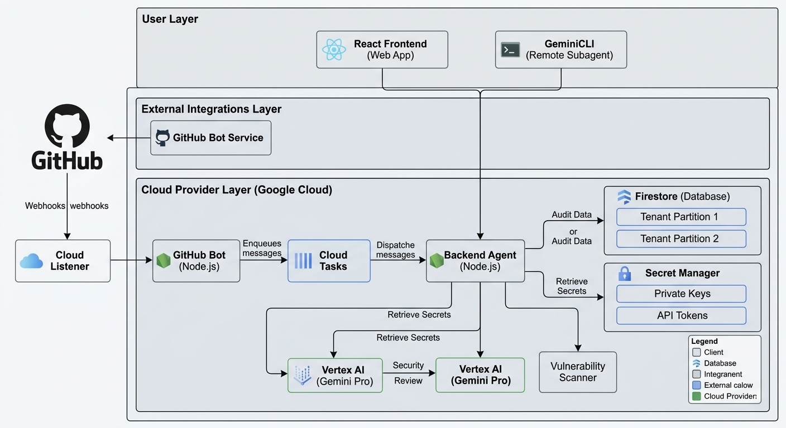

# Security Audit Agent Platform


A professional, multi-tenant platform for automated functional and security audits of source code. Powered by Google Gemini 3.1 Flash and designed for reliability on Google Cloud Platform.

## 🏗️ Architecture Overview

The system is a multi-modal security intelligence platform built entirely on **Google Cloud**. It provides a high-level orchestration layer between modern development workflows and generative AI, enabling automated and on-demand security auditing across Web, CLI, and GitHub environments.



### Core Services
- **Frontend (React + Vite)**: A centralized dashboard for managing multi-tenant GitHub integrations and viewing historical audit reports.
- **GeminiCLI**: A terminal-based interface allowing developers to trigger ad-hoc security audits directly from their local machine.
- **Backend Agent (Node.js)**: The core intelligence engine. It manages multi-tenant state (Firestore), secure credentials (Secret Manager), and coordinates with Gemini AI for deep code analysis.
- **GitHub Bot**: A high-performance webhook processor that automates security checks on Pull Requests using Google Cloud Tasks for reliable job queuing.

## 🛡️ Detailed System Design

For a deeper look into the internal service interactions, multi-tenant partitioning, and secure data flows, refer to the detailed architecture diagram below.



### Security & Multi-tenancy
- **Isolation**: Each tenant's data is partitioned within **Firestore**, ensuring strict data boundaries for audits and findings.
- **Secret Management**: All sensitive credentials, including GitHub Private Keys and API Tokens, are stored in **Google Cloud Secret Manager** and retrieved just-in-time by the Backend Agent.
- **AI Orchestration**: The system leverages **Vertex AI (Gemini Pro)** to perform context-aware security reviews, providing actionable remediation advice.

## 🔄 Global Flows

### 1. Automated PR Review Flow
When a user pushes code to a Pull Request:
1.  **Event**: GitHub sends a `pull_request` webhook to the Bot.
2.  **Auth**: Bot verifies the HMAC signature and retrieves user config from Firestore.
3.  **Queue**: Bot enqueues an analysis job in **Google Cloud Tasks** to ensure reliability.
4.  **Process**: Cloud Task triggers the Bot's internal analysis endpoint.
5.  **Audit**: Bot fetches the PR diff and requests a structured analysis from the Agent.
6.  **AI**: Agent invokes Gemini 3.1 Flash with specialized security engineering instructions.
7.  **Feedback**: Bot posts findings back to the PR as inline comments and a summary.

### 2. Manual Audit (Web Dashboard)
1.  **Input**: User provides code via the Frontend dashboard (text, file, or URL).
2.  **Request**: Frontend calls the Agent's `/api/analyze` endpoint.
3.  **Analysis**: Agent processes the input and performs the AI audit.
4.  **Report**: Frontend renders a detailed Markdown report with security findings.

### 3. Manual Audit (GeminiCLI)
1.  **Request**: Developer issues an audit command via the `gemini` CLI.
2.  **Execution**: The CLI connects directly to the **Backend Agent**'s secure Cloud Run endpoint (utilizing the [Remote Configuration](.gemini/agents/security-auditor.md) as a bridge).
3.  **Result**: The AI-driven analysis is streamed back directly to the developer's terminal in real-time.

## 📺 Demo

[](https://www.youtube.com/watch?v=slhhe9_lRtQ)

## 📁 Project Structure

- **[`/agent`](./agent)**: The "Brain" - Analysis engine and multi-tenant API.
- **[`/frontend`](./frontend)**: The "Portal" - React user dashboard.
- **[`/github-bot`](./github-bot)**: The "Worker" - Webhook listener and queue manager.
- **[`/docs`](./docs)**: Strategic guides for setup and deployment.

## 🚀 Getting Started

### Local Setup
```bash
# Install all dependencies
npm install

# Start services (Requires local .env configuration)
cd agent && npm run dev
cd frontend && npm run dev
```

### Cloud Deployment
For full production setup, see the **[Deployment Guide](./docs/deployment.md)**.

## 🔒 Security Principles
- **Credential Isolation**: GitHub Private Keys are stored in Google Cloud Secret Manager.
- **Zero-Trust Webhooks**: Every webhook is verified using app-specific shared secrets.
- **Atomic Operations**: All multi-step database updates use Firestore Transactions.

---
&copy; 2026 Security Audit Agent &bull; Functional and Security Analysis for the AI Era.
