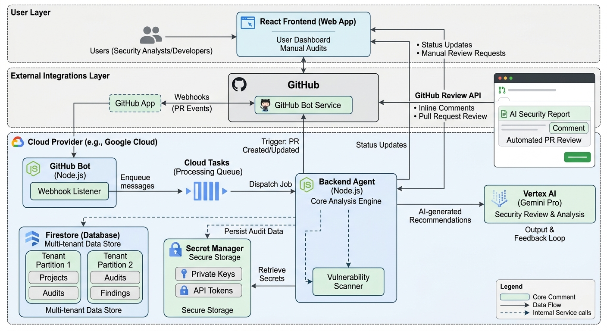

# Security Audit Agent Platform


A professional, multi-tenant platform for automated functional and security audits of source code. Powered by Google Gemini 3.1 Flash and designed for reliability on Google Cloud Platform.

## 🏗️ Architecture Overview

The system is built as a distributed microservices platform, leveraging serverless computing and managed database services for high availability and security.



### Core Services
- **Frontend (React + Vite + Tailwind)**: The command center. Users manage their GitHub integrations, view historical audit reports, and perform on-demand manual scans.
- **Backend Agent (Node.js/Express)**: The intelligence hub. Responsible for code retrieval (Git cloning), multi-tenant state management (Firestore), secure credential storage (Secret Manager), and AI orchestration (Gemini).
- **GitHub Bot (Node.js)**: The automation bridge. A lightweight webhook processor that handles incoming PR events and manages long-running analysis tasks via Cloud Tasks.

## 🔄 Global Flows

### 1. Automated PR Review Flow
When a user pushes code to a Pull Request:
1.  **Event**: GitHub sends a `pull_request` webhook to the Bot.
2.  **Auth**: Bot verifies the HMAC signature and retrieves user config from Firestore.
3.  **Queue**: Bot enqueues an analysis job in **Google Cloud Tasks** to ensure reliability.
4.  **Process**: Cloud Task triggers the Bot's internal analysis endpoint.
5.  **Audit**: Bot fetches the PR diff and requests a structured analysis from the Agent.
6.  **AI**: Agent invokes Gemini 3.1 Flash with specialized security engineering instructions.
7.  **Feedback**: Bot posts findings back to the PR as inline comments and a summary.

### 2. Manual On-Demand Audit
1.  **Input**: User provides code via the Frontend dashboard (text, file, or URL).
2.  **Request**: Frontend calls the Agent's `/api/analyze` endpoint.
3.  **Analysis**: Agent processes the input and performs the AI audit.
4.  **Report**: Frontend renders a detailed Markdown report with security findings.

## 📁 Project Structure

- **[`/agent`](./agent)**: The "Brain" - Analysis engine and multi-tenant API.
- **[`/frontend`](./frontend)**: The "Portal" - React user dashboard.
- **[`/github-bot`](./github-bot)**: The "Worker" - Webhook listener and queue manager.
- **[`/docs`](./docs)**: Strategic guides for setup and deployment.

## 🚀 Getting Started

### Local Setup
```bash
# Install all dependencies
npm install

# Start services (Requires local .env configuration)
cd agent && npm run dev
cd frontend && npm run dev
```

### Cloud Deployment
For full production setup, see the **[Deployment Guide](./docs/deployment.md)**.

## 🔒 Security Principles
- **Credential Isolation**: GitHub Private Keys are stored in Google Cloud Secret Manager.
- **Zero-Trust Webhooks**: Every webhook is verified using app-specific shared secrets.
- **Atomic Operations**: All multi-step database updates use Firestore Transactions.

---
&copy; 2026 Security Audit Agent &bull; Functional and Security Analysis for the AI Era.
