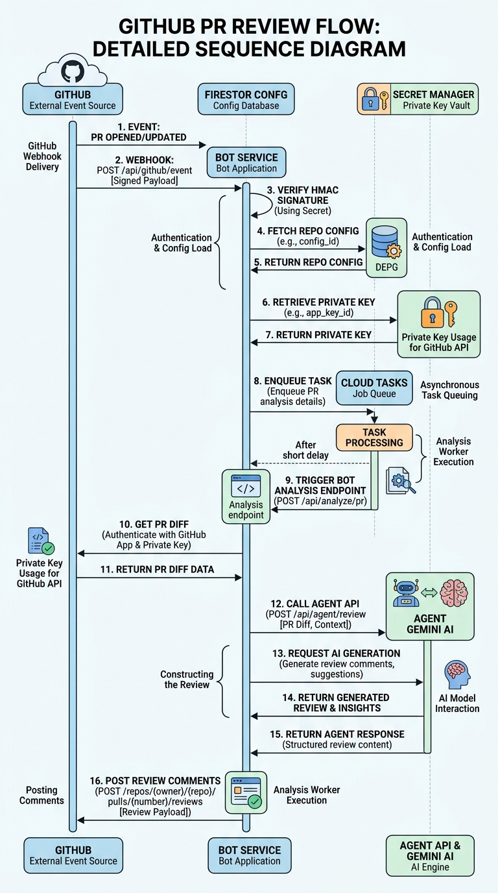

# GitHub Security Review Bot

The automation bridge between GitHub and the Security Audit Agent. It transforms webhooks into reliable, queued security reviews.

## 🔄 Automated Review Flow

The bot follows a robust sequence to ensure no PR event is lost, even under heavy load or cold starts.



1.  **Webhook Admission**: Receives `pull_request` events. Verifies the `X-Hub-Signature-256` HMAC to ensure authenticity.
2.  **Config Resolution**: Fetches the unique App ID, Webhook Secret, and Private Key (from Secret Manager) associated with the installation.
3.  **Reliability Enqueue**: Instead of processing the review in-memory, the bot enqueues a job in **Google Cloud Tasks**.
4.  **Task Execution**: Cloud Tasks invokes the bot's `/task/process-pr` endpoint.
5.  **Agent Orchestration**: The bot fetches the PR diff, calls the Core Agent's analysis endpoint, and receives a structured security report.
6.  **GitHub Feedback**: Findings are posted as a high-level summary and detailed inline comments on the specific lines of code.

## 🚀 Key Features
- **Stateless & Scalable**: Designed for Google Cloud Run with no local state.
- **Trace Correlation**: Passes `X-Cloud-Trace-Context` to the Agent, allowing for a single trace view of an entire PR review in Cloud Logging.
- **Manual "Summon"**: Reviews can be manually re-triggered by adding the `security-review` label to any PR.

## 📦 Deployment (Cloud Run)
```bash
gcloud run deploy github-security-bot \
  --source . \
  --port 3001 \
  --set-env-vars="AGENT_API_URL=...,BOT_URL=...,GOOGLE_CLOUD_PROJECT=..."
```

## 🛠 Local Development
1. `npm install`
2. Configure `.env` with a `GITHUB_WEBHOOK_SECRET` for testing.
3. Start local agent and bot.
4. Use `smee-client` to forward webhooks to `http://localhost:3001/api/webhook`.
